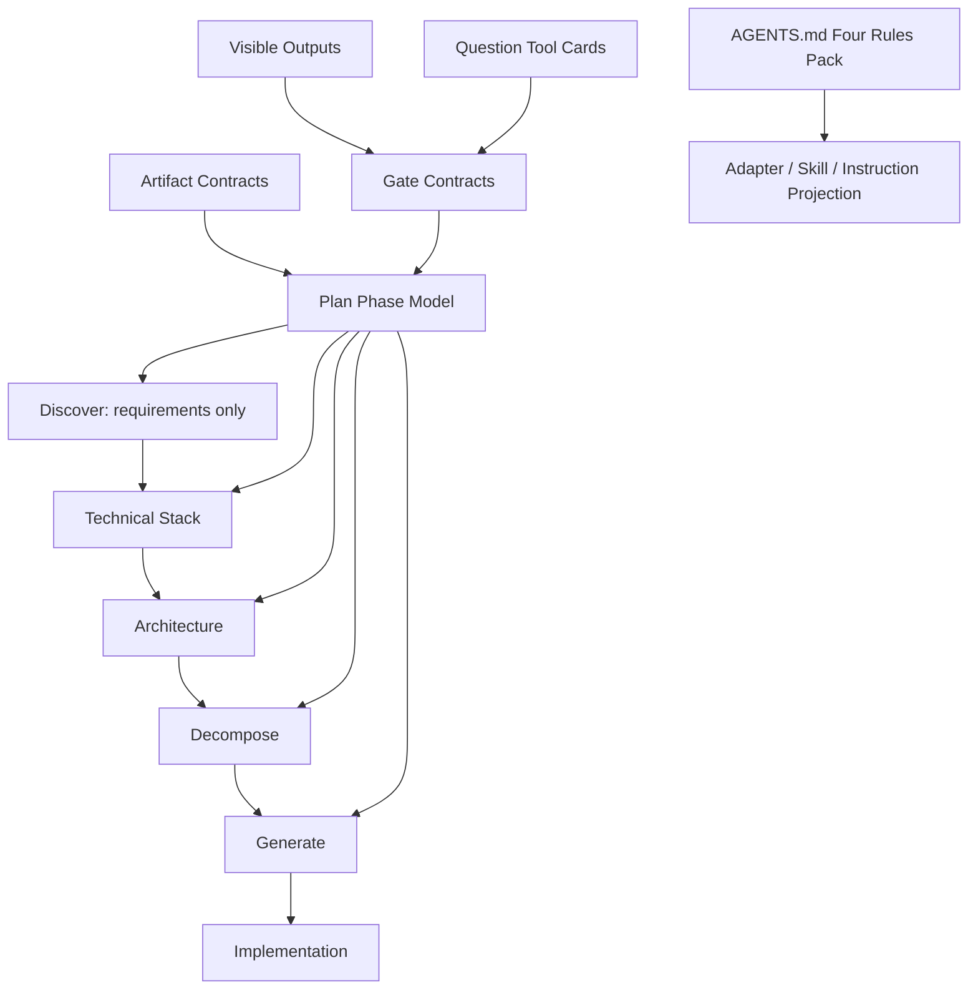

# C19 Architecture — Workflow 核心内容与 Plan 模式优化

## 工作类型

C19 是 refactor/build Cycle，目标是优化 Hypo-Workflow 的固定提示词规则、Plan 阶段模型、阶段产物可见性、Question Tool 门控、图表化计划产物，以及源仓到 Codex-VSP / VSP-Open-Code 的集成适配流程。

## 架构原则

1. Hypo-Workflow 不是 runner。
   - `core/` 只做 deterministic helper、contract normalization 和 artifact generation。
   - 实际推理、交互、实现和验证仍由 Codex、Claude Code 或 OpenCode Agent 完成。
2. `.pipeline/` 仍是状态、Cycle、Progress、Rules、Prompts、Reports 和集成记录的源。
3. `.plan-state/` 存放规划阶段的中间产物和可见检查点。
4. 用户可见的阶段切换必须先展示实际阶段产物，再使用 Question Tool 或等效结构化门控确认。
5. 不复制源仓 runtime `.pipeline/state.yaml`、`.pipeline/cycle.yaml` 或 `.pipeline/log.yaml` 到目标集成仓库。

## C19 目标架构

## 架构目标

1. Plan Phase Model
   - 将 Plan 从旧 P1/P2/P3/P4 语义微调为 Discover、Technical Stack、Architecture、Decompose、Generate、Implementation。
   - Discover 只讨论需求，不讨论技术栈、模块、实现路线或架构接入。
   - Technical Stack 讨论技术承载、现有栈和实现机制。
   - Architecture 读取当前架构、输出架构图和接入点。
   - Decompose 结合需求、技术栈和架构产物拆 Milestone。
   - Generate 生成 prompts、配置、架构和执行产物。

2. Plan Command Surface
   - 保持 `/hw:plan` 为主入口。
   - 新增或暴露命名阶段子命令：`/hw:plan:technical-stack` 和 `/hw:plan:architecture`。
   - 移除用户态 `confirm` 命令；确认行为改为阶段内 Question Tool / Ask 门控。

3. Gate Visibility Contract
   - 每个阶段进入下一阶段前必须展示本阶段摘要、决策表和待确认问题。
   - 重大门控必须使用 Question Tool 或平台等效结构化 Ask。
   - 确认卡片前或卡片内必须让用户看到实际确认内容，不能只给文件路径。

4. AGENTS.md Four Rules Pack
   - 行为指导规则包包括 Think Before Coding、Simplicity First、Surgical Changes 和 Goal-Driven Execution。
   - 规则包推荐启用，但不强制改变所有项目默认值。
   - 这些纪律必须投影到 managed instructions、平台 adapter、Skills 和生成提示中。

5. Visual Planning Artifacts
   - 默认使用 Mermaid 和 Markdown table。
   - 支持阶段流程图、架构图、Milestone 表、决策矩阵和依赖关系图。
   - 如需 PNG/SVG/交互视图，作为后续扩展而非 C19 默认范围。

6. Integration Sync Scope
   - C19 纳入 Codex-VSP 和 VSP-Open-Code 目标适配。
   - 源仓完成后必须先生成 target adaptation plan，列出文件清单、非目标和验证命令。
   - 目标仓写入必须等待用户显式确认。

## 接入点

| 接入点 | 当前文件 | C19 责任 |
|---|---|---|
| Plan Skills | `skills/plan*.md` | 更新阶段语义、门控规则、可见产物要求和 Question Tool 纪律。 |
| Core phase model | `core/src/progressive-discover/index.js` | 新增阶段常量、completion/gate contracts、required visible outputs 和产物 schema。 |
| Graph/table helpers | `core/src/batch-plan/index.js` | 扩展 Mermaid / Markdown table 渲染能力，支持计划图表产物。 |
| Rules pack | `rules/packs/karpathy/guidelines/*.yaml` | 增强 AGENTS.md 四规则说明，保持可推荐启用。 |
| Adapter guidance | `core/src/artifacts/agent-guidance.js` | 抽象 Ask/Question、阶段可见产物和四规则指导。 |
| OpenCode adapter | `core/src/artifacts/opencode.js`、`plugins/opencode/templates/AGENTS.md` | 生成包含新阶段纪律和四规则投影的 AGENTS.md、commands、agents。 |
| Claude adapter | `core/src/artifacts/claude.js` | 生成包含新阶段纪律和四规则投影的 Claude Code command/agent 指令。 |
| Command map/spec | `core/src/commands/index.js`、`references/commands-spec.md`、`commands/plan*.md` | 微调 `/hw:plan*` 命令面，新增/暴露 `/hw:plan:technical-stack` 和 `/hw:plan:architecture`，移除用户态 `confirm`。 |
| Tests | `core/test/*.test.js` | 覆盖阶段模型、门控可见性、adapter 投影、四规则和命令映射。 |
| Integration sync | `references/integration-sync-spec.md` | 指导 Codex-VSP / VSP-Open-Code 目标适配计划、确认、验证和记录。 |

## 外部副作用边界

- Source-side implementation 不写 `~/Codex-VSP` 或 `~/VSP-Open-Code`。
- Target adaptation 必须在源仓完成、文件清单和验证命令展示后，经用户确认才能执行。
- 保留目标仓 dirty worktree，不回滚或覆盖无关用户改动。
- 不需要网络、系统级依赖安装或服务重启，除非后续 Decompose 明确提出并经确认。

## 验收规则

- Plan 阶段切换必须展示实际阶段产物，不能只给文件路径。
- Question Tool / Ask 必须主动用于关键门控。
- Discover 不依赖固定轮次，而依赖范围、用户期望效果和验收标准清晰度。
- 技术栈和架构讨论不得提前混入 Discover。
- 生成的平台指令必须包含 AGENTS.md 四规则纪律。
- 图表产物至少覆盖 Mermaid 阶段流程图、架构图和 Milestone/决策表。
- 测试必须覆盖 Skill/spec、core helper、adapter artifacts、rules pack、command map 和 integration sync gate。
