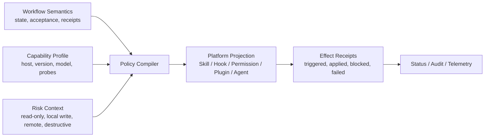

# C21 前置全局设计审计 — Audit 002

> 时间：2026-07-10T21:21:28+08:00  
> Language：zh-CN  
> Timezone：Asia/Shanghai  
> Verdict：**BLOCKED**  
> Findings：**6 Critical / 7 Warning / 3 Info**

## 0. 判定说明

本次 `BLOCKED` 的含义是：**不建议基于现有草案直接开始 vNext 实现，也不建议继续增加命令、规则或平台适配面**。它不表示 Hypo-Workflow 整体不可用。仓库的核心 helper、测试资产和工作流覆盖面都已经相当丰富；真正的问题是，系统的“权威定义、平台投影、运行时执行、效果回执”增长速度不一致。

最短结论是：

> Hypo-Workflow 现在不是缺少功能，而是拥有很多权威、很多投影和很多声明，但缺少一条能够证明“声明已经在正确宿主上产生预期效果”的统一闭环。

Critical findings 默认阻断 Cycle acceptance 和直接实现。后续可以继续讨论、做原型和形成 Plan；只有在用户明确接受 defer、指定风险承担方式并记录 follow-up route 后，才应绕过这些阻断项。

## 1. Intake

| 项目 | 本轮定义 |
|---|---|
| Trigger | 用户要求扩展 C21，先做一次大范围研究扫描，再进行多轮开放讨论。 |
| Primary workflow | 全局指令与约束、Plugins / Skills / Hooks / 平台适配、RULES 与命令有效性、Maintain / Stash 模型。 |
| Good state | 能区分真实故障、架构债务、待验证假设和设计偏好；给出可讨论的优先级，不提前实现。 |
| Correctness contract | 结论必须同时有本地代码/运行数据证据和当前官方平台文档；没有使用遥测时不得断言命令无人使用。 |
| Scope | 仓库权威文件、生成产物、核心 runtime、Hooks、Skills、Rules、Maintain 全局数据、测试、官方平台能力。 |
| Exclusions | 不修复代码；不重启服务；不安装依赖；不写目标仓；不清理用户已有 dirty worktree。 |
| Risk tolerance | 错误的硬门禁、错误完成状态、无效安全确认、受支持平台的已发布陈旧产物为 Critical。 |
| Handoff | 详细报告作为 C21 研究证据；简版报告用于下一轮讨论。 |

## 2. 方法与证据边界

### 2.1 方法

- **GQM**：围绕“约束是否必要且有效”“平台能力是否被正确利用”“功能是否真实产生效果”“Maintain 模型是否可恢复”建立问题、指标与证据。
- **ISO/IEC 25010**：重点检查功能适合性、可靠性、可维护性、兼容性、可用性和安全性。
- **ATAM-lite**：用能力演进、宿主差异、失败恢复、外部副作用和生成产物漂移作为架构场景。
- **SWEBOK**：对需求契约、设计、构造、测试、维护和配置管理进行交叉核验。

### 2.2 扫描规模

- 1,960 个 tracked files。
- 45 个 Skills，合计约 5,107 行。
- 53 个 canonical commands，`commands/` 合计约 4,505 行。
- 128 个 core test files；完整 `npm test` 运行 687 个测试。
- 53 个 Claude command wrappers，约 328 KB / 4,558 行。
- `.pipeline/log.yaml` 973 条 lifecycle events。
- 用户级 Maintenance：113 条 JSONL ledger events、441 个 evidence files、约 15 MB。

### 2.3 证据等级

| 等级 | 含义 |
|---|---|
| Observed | 从当前代码、生成产物、真实全局状态或命令输出直接验证。 |
| Inferred | 由 Observed 证据推导，但尚未在最新版宿主做安装级 smoke。 |
| Unknown | 官方协议或本地遥测不足，报告明确保留未知。 |

本轮没有在所有宿主上启动真实安装 smoke，因此“Hook 返回结构与官方协议不匹配”属于高置信度静态结论；“宿主究竟忽略、警告还是拒绝未知事件”仍保留为 Unknown。

## 3. Findings — Experience

### EXP-01 — Cursor 受支持产物已陈旧，健康检查仍报告不到

- **Severity**：Critical
- **Location**：`core/src/commands/index.js:1`、`.cursor/skills/hypo-workflow.md:35`、`core/src/sync/index.js:32-42,247-275,486-497`
- **Symptom**：权威注册表有 53 个命令，checked-in Cursor commands/skills 各只有 41 个；缺少 Maintain 子命令、Quality、Optimize、Technical Stack、Architecture，仍保留已移除的 `/hw:plan:confirm`。
- **Cause**：Cursor bundle 没有进入统一 derived artifact manifest；`sync --check-only --platform cursor` 仍以 `.opencode/hypo-workflow.json` 作为 adapter freshness 目标。
- **Evidence**：21 个 mirrored references 与主源一致，13 个不同，10 个缺失；当前 Cursor router 仍分发旧 V12/V9 语义。
- **Impact**：用户在被宣称支持的平台上得到旧命令面和旧工作流契约，且项目自身检查无法发现。
- **Recommendation**：建立唯一 artifact manifest，让 generator、checked-in parity、check-only、release gate 共用同一清单；在修复前将 Cursor 标为 `degraded`，而非完整支持。
- **Route**：C21 Architecture / adapter artifact graph。

### EXP-02 — 无法回答 Rule 和命令是否真正被使用

- **Severity**：Warning
- **Location**：`references/log-spec.md:17-42`、`plugins/opencode/templates/plugin.ts:43-57,131-143`、`.pipeline/log.yaml`
- **Symptom**：用户能看到 Rule 存在、命令存在，却看不到匹配次数、阻断次数、最后执行时间或结果。
- **Cause**：生命周期日志没有 `command_invoked`、`skill_triggered`、`rule_evaluated`、`rule_blocked`、`hook_effect_applied` 等持久化事件；OpenCode 的 `command.executed` 只写 host logger。
- **Evidence**：973 条 lifecycle events 中 182 条由 `user|manual` 触发，但无法还原 canonical command；53 个命令中 25 个没有精确文本命中，这只是弱代理，不是使用率。
- **Impact**：无法有证据地删减命令、调整规则等级或判断某个 Hook/Skill 是否值得维护。
- **Recommendation**：增加本地、脱敏、默认不记录参数正文的 effect receipts；先观测一个 Cycle，再做命令弃用决策。
- **Route**：C21 effectiveness telemetry。

### EXP-03 — Maintain 的 status surface 与真实运行活动脱节

- **Severity**：Warning
- **Location**：`core/src/maintenance/index.js:820-842`、用户级 `~/.hypo-workflow/maintenance/`
- **Symptom**：全局 queue 只有 2 个 completed items，但 113 条 ledger events 中 52 条是 daily summary、51 条是 global consolidation；`maintain status` 主要读取 queue，无法解释 91% 的定时活动。
- **Cause**：手动 Operation Queue、Scheduled Job、Run、Ledger 和 Evidence 没有共享 read model；没有 retention/rotation policy。
- **Evidence**：当前 evidence 441 个文件、约 15 MB；global consolidation 每日 5 个文件，daily summary 每日 3 个文件。
- **Impact**：用户看到的“状态”不代表系统实际在做什么，也无法从 UI/命令发现空跑、失败通知和积压。
- **Recommendation**：把 Scheduled Job、Operation、Run receipt、Evidence health 汇总成统一只读视图；对象本身保持分域。
- **Route**：C21 Maintain discussion。

### EXP-04 — 53 个命令可能造成发现成本，但现在不能直接删除

- **Severity**：Info
- **Location**：`core/src/commands/index.js`、`references/commands-spec.md`
- **Symptom**：Plan phase、Maintain action 和生命周期命令同时占据一级 canonical command map。
- **Cause**：每次扩展都倾向新增可见命令，缺少“常用入口 / 高级动作 / 内部 action”的产品层级。
- **Evidence**：`/hw:rules`、`/hw:stop`、`/hw:skip`、`/hw:report`、`/hw:guide`、`/hw:compact`、`/hw:knowledge`、`/hw:explore`、`/hw:showcase` 没有直接调用证据；8 个 Maintain 子命令也没有真实调用证据。但日志没有 invocation telemetry。
- **Impact**：学习与维护成本可能高于收益；误删又可能破坏低频但关键的恢复动作。
- **Recommendation**：先分组并增加 telemetry，再讨论 alias、advanced namespace 和 deprecation；不要把“无证据”解释为“无人使用”。
- **Route**：C21 command surface discussion。

## 4. Findings — Engineering

### ENG-01 — RULES 是 authority/projection，不是规范承诺的执行系统

- **Severity**：Critical
- **Location**：`references/rules-spec.md:207-220`、`core/src/rules/index.js:201-247,402-426`、`hooks/session-start.sh:110-118`
- **Symptom**：规范承诺在 hook point 运行 check，`warn` 继续、`error` 停止；实际 core 只做加载、归一化、合并和渲染，没有通用 dispatcher/checker registry。
- **Cause**：规则内容被当成 Agent instruction 投影；severity、hook 和 preset 没有编译成可执行 policy。
- **Evidence**：`pre-milestone/post-step/on-evaluate/pre-release` 在 runtime 主要是枚举；SessionStart 只注入摘要并以 `|| true` 静默失败；OpenCode artifact loader 解析失败时 fail-open。实测 `extends: minimal` 后部分应为 `off` 的规则仍为 `warn`，Four-Rule pack 为 `off` 时 guidance 仍无条件注入。
- **Impact**：`error` 的语义不可依赖，直接解释了 RULES“有设计但没感觉被用到”。
- **Recommendation**：拆成 `authority resolver -> policy compiler -> hook dispatcher -> checker registry -> receipt`；把规则明确标为 `deterministic gate`、`observable advisory` 或 `prompt guidance`。
- **Route**：C21 Rules runtime architecture。

### ENG-02 — 定时 Global Consolidation 持续生成空数据，并被外围记录为完成

- **Severity**：Critical
- **Location**：`core/src/maintenance/session-sources.js:12-17`、`core/src/maintenance/consolidation.js`、用户级 `evidence/global-consolidation/`
- **Symptom**：最新 source artifact 的四类 `records` 全为空；run artifact 仍停在 `status: planned`，输出却生成五类通用候选，外围 scheduler/ledger 将任务记作完成。
- **Cause**：默认 source root 是相对于项目 CWD 的 `.codex/sessions`、`.opencode/sessions`、`.claude/projects`；真实会话位于用户级目录。空输入没有触发 no-data/error gate，状态也没有从计划到执行/完成的统一提交。
- **Evidence**：真实用户目录存在大量会话文件；最新 `mr-global-consolidation-20260709-sources.yaml` 为全空；outputs 的 `source_record_refs` 全空；backfill 每天重新从 2026-03-01 生成 pending shards。
- **Impact**：主定时工作流制造“有产出”的假象、持续积累 boilerplate evidence，并使历史回填看似推进但没有 durable cursor。
- **Recommendation**：先停止把空运行标为完成；使用明确的 user-store resolver、no-data outcome、可提交 cursor 和 end-to-end live-path test。
- **Route**：C21 Maintain correctness before redesign。

### ENG-03 — Claude/OpenCode Hook 适配的关键效果与当前宿主协议不匹配

- **Severity**：Critical
- **Location**：`core/src/claude-hooks/index.js:12,112,159`、`core/src/opencode-hooks/index.js:26,45,144`、`.opencode/plugins/hypo-workflow.ts:423,443,455,508`
- **Symptom**：Claude 上下文和 PermissionRequest 决策返回层级错误；OpenCode file guard 早退为 allow，保护逻辑不可达，事件桥读取错误层级，auto-continue 没有真实测试证据。
- **Cause**：Hook 事件和返回结构没有版本化 adapter contract，也没有宿主级 effect smoke。
- **Evidence**：Claude 当前协议要求 `hookSpecificOutput.additionalContext` 与 `hookSpecificOutput.decision.behavior`，本地返回顶层字段；timeout 使用 `3000/5000` 而当前单位为秒。OpenCode event payload 位于 `event.properties`，本地按顶层读取；heartbeat 只写日志，不更新 Workflow state。
- **Impact**：上下文注入、权限策略、受保护文件和“安全续跑”等关键承诺可能完全没有生效，而生成和单元测试仍为绿色。
- **Recommendation**：按事件建立平台适配器；每个 Hook 用真实宿主 smoke 证明“触发、解析、效果、回执”四件事。YOLO/allow 若为产品选择，必须明确标为 observability-only。
- **Route**：C21 platform runtime verification。

### ENG-04 — 平台能力模型已过时，且不是运行时决策层

- **Severity**：Warning
- **Location**：`core/src/platform/index.js:1-94`、`docs/reference/platforms.md`、`references/platform-codex.md:5-32`
- **Symptom**：Codex 仍被描述为没有完整 hook/plugin、events limited；Cursor/Trae 被当成 instruction-only/host-dependent；Kimi Code/ZCode 缺席。
- **Cause**：静态字符串矩阵只用于文档生成，不含最低版本、probe、confidence、fallback 或 instruction selection。
- **Evidence**：当前官方能力显示 Codex 已支持 Plugins/Hooks/Subagents/Automations；Cursor、Trae 已支持 Skills/Commands/Subagents/Hooks/MCP；Kimi Code 支持 Skills/Plugins/Agents/Hooks/MCP；ZCode 已有 Skills/Commands/Subagents 和 Beta Plugin。
- **Impact**：系统一边重复用 prompt 模拟宿主已经能机械执行的能力，一边遗漏新平台原生格式与边界。
- **Recommendation**：引入版本化 Capability Profile：`supported|partial|unknown`、min version、protocol、limitations、verified_at、probe；区分 host、model、workflow risk、user policy 四个轴。
- **Route**：C21 capability/policy compiler。

### ENG-05 — Authority 到生成产物的闭环不完整，多条基线并存

- **Severity**：Warning
- **Location**：`core/src/sync/index.js:247-350`、`references/v9-architecture.md`、`.pipeline/architecture.md`、`hooks/hooks.json`、`core/src/claude-hooks/index.js`
- **Symptom**：current architecture 仍停在 C19，分发 bundle 仍引用写有 36 commands 的 V9 架构；Claude plugin shell hooks 与 project-sync Node wrapper 是两套行为；plugin marketplace 版本与 Codex plugin 版本不同。
- **Cause**：缺少 source ownership graph 与唯一 current contract；历史文档、runtime resource、checked-in artifact 混在一起。
- **Evidence**：`.pipeline/architecture.md` 仍写 Discover 不依赖固定轮次，而当前配置设 `min_rounds: 5`；`.agents/plugins/marketplace.json` 为 `12.3.0`，`.codex-plugin/plugin.json` 为 `13.1.0-beta.2`。
- **Impact**：同步、安装、文档和运行时会因入口不同得到不同语义。
- **Recommendation**：建立 artifact/authority manifest；current architecture 使用无版本名权威文档，历史版本转 ADR；每种安装路径加入 parity/smoke。
- **Route**：C21 source ownership and distribution。

### ENG-06 — 配置、Schema、Profile 和文档没有单一语义权威

- **Severity**：Warning
- **Location**：`SKILL.md:332-371`、`references/config-spec.md:56-57`、`config.schema.yaml:3-4,1012-1022,1420-1422,1823-1839`、`core/src/profile/index.js`
- **Symptom**：缺省语言/时区存在 `en/UTC` 与 `zh-CN/Asia/Shanghai` 多套答案；Schema 自称 V7、version pattern 只到 11；部分 profile 字段没有改变最终产物。
- **Cause**：默认值和策略在 Skill、spec、schema、core、profile 中手工复述；validator 只做浅层字段检查。
- **Evidence**：OpenCode `strict` profile 声明 `permissions: ask`，renderer 实际固定输出 `allow`；protected-file deny helper 存在但未被调用。
- **Impact**：用户无法理解 `strict` 真正约束什么；绿色配置检查不能证明语义一致。
- **Recommendation**：用 typed authority 生成 schema/docs/defaults；提供 `effective-policy explain`；以真正 schema validator 和因果测试验证 profile 对最终产物的影响。
- **Route**：C21 configuration/policy model。

### ENG-07 — 共享 guidance 被无条件复制，模型增强无法自然减少约束

- **Severity**：Warning
- **Location**：`core/src/artifacts/agent-guidance.js`、`core/src/artifacts/claude.js:78`、53 个 Claude command wrappers
- **Symptom**：Consultation、Four-Rule、Ask guidance 出现在 127 个生成 surface；所有 Claude 命令，包括 help/status，都嵌入完整 DeepSeek Tool Calling Rules。
- **Cause**：生成器按文件拼接大段共享文本，没有按 route risk、host capability 和 model quirk 编译最小 instruction set。
- **Evidence**：根 Skill 已有 1,044 行；45 个 Skills 都重复 output-language resolution；47/53 Claude wrappers 共享完全相同的 72 行尾部。
- **Impact**：增加 token 和认知成本，更重要的是扩大漂移面，并把特定模型补丁错误地投影到所有模型/命令。
- **Recommendation**：wrapper 只保留路由元数据；政策按能力和风险编译。模型更强时可压缩 prompt guidance，但不得削弱机械权限与外部副作用边界。
- **Route**：C21 instruction compiler。

### ENG-08 — 单元测试全绿，但系统回归门为红色

- **Severity**：Warning
- **Location**：`core/test/`、`tests/run_regression.py`、`tests/results/20260710T210851-all-68.json`
- **Symptom**：`npm test` 687/687 通过；scenario regression 只有 62/68 通过。
- **Cause**：单元测试证明 helper/临时生成器行为，但缺少 checked-in parity、真实 authority、宿主协议 effect 和 current scenario contract；部分回归断言仍固定 41 commands、旧 audit 分类和旧 patch 文件名。
- **Evidence**：失败场景为 `s19-help-list`、`s24-audit-report`、`s38-patch-fix-flow`、`s43-v8-2-registration`、`s50-rules-system`、`s59-v9-regression-bundle`。
- **Impact**：测试结果无法给出一个一致的 release-readiness 结论，也解释了为什么生成产物漂移未被阻断。
- **Recommendation**：先更新 scenario authority，再增加 repo parity、Rule hook result、schema/default consistency、multi-install Hook smoke 和 capability-to-artifact 因果测试。
- **Route**：C21 verification architecture。

### ENG-09 — 模型约束应分层，而不是简单设置“强模型少规则”

- **Severity**：Info
- **Location**：全局 instruction/profile 设计
- **Symptom**：现有 profile 把宿主权限、工作流安全、交互脚手架和模型兼容提示混在一起。
- **Cause**：约束按产品档位命名，而不是按可失败机制分类。
- **Evidence**：DeepSeek guidance 被全平台复制；OpenCode strict 对 permission 无因果效果；Codex 已有原生 Hook/Plugin 但仍依赖长 AGENTS/Skill 纪律。
- **Impact**：直接按模型名减规则，可能同时删掉安全底线；继续全量投影又浪费能力更强模型的上下文。
- **Recommendation**：三层政策：`mechanical safety`（不可随模型削弱）、`workflow invariants`（按风险启用）、`behavioral scaffolding`（可按模型/实测压缩）。
- **Route**：C21 model/capability experiment design。

### ENG-10 — Maintain / Stash 的目标模型应先收敛对象，再收敛命令

- **Severity**：Info
- **Location**：`skills/maintain/SKILL.md:83-91`、`core/src/maintenance/index.js`
- **Symptom**：Maintain Run 声称 pause/resume/cursor，但没有独立持久化 authority；Operation 和 Run 各有状态词，却没有合法迁移表。Stash 草案又可能把 Git、Workflow 和任务切换混为一体。
- **Cause**：概念从命令和 helper 向上生长，没有先确定领域对象和所有权。
- **Evidence**：实测 queue 可从 `queued -> completed`、run 可从 `planned -> completed`；普通 `git stash` 会混合被跟踪的 Workflow metadata 与产品改动，而忽略的 runtime state 又可能不在其中。
- **Impact**：若直接实现 Stash 或继续扩展 Run，会增加第三套恢复语义。
- **Recommendation**：Operation 作为唯一可执行状态机；Run 只聚合/cursor；Scheduled Job 独立；Stash 产品概念优先叫 Checkpoint/Suspend，Git stash 仅为可替换机制。
- **Route**：C21 Maintain/Stash domain discussion。

## 5. Findings — Risk

### RISK-01 — 真实 Maintenance authority 已无法通过当前 validator

- **Severity**：Critical
- **Location**：`core/src/maintenance/index.js:158-174,624-634`、`core/src/ledger/index.js:89-100`、用户级 `queue.yaml` / `ledger.jsonl`
- **Symptom**：全局 queue 2/2 items invalid；113 条 ledger events 中迁移来的前 9 条造成 27 个必填字段错误。
- **Cause**：旧 YAML ledger 原样迁移到 JSONL，没有 schema normalization；queue 的历史 `scope`/`side_effect` shape 与新 validator 不兼容；定时任务绕过整本 ledger validator 直接 append。
- **Evidence**：Skill/spec 仍称 `ledger.yaml`，实际持续更新的是 `ledger.jsonl`；`ledger.summary.yaml` 已声明 JSONL authority。
- **Impact**：手动 Maintain 路径可能因历史数据失败，而 scheduler 继续写入同一逻辑域，进一步扩大权威分裂。
- **Recommendation**：在任何模型重构前完成 versioned store migration、逐条兼容 normalization、quarantine 和一致 append API；禁止 validator 与 scheduler 双轨。
- **Route**：C21 Maintenance data migration gate。

### RISK-02 — 高风险副作用确认只信任可伪造布尔值

- **Severity**：Critical
- **Location**：`core/src/maintenance/index.js:437-442,603-617`
- **Symptom**：`remote_write` / destructive side-effect gate 接受 `confirmed: true` 即放行，不验证 actor、来源、确认文本、计划 hash 或 receipt。
- **Cause**：安全边界停留在 Agent 输入约定，没有绑定用户决策证据。
- **Evidence**：实测 `{ level: "remote_write", confirmed: true, actor: "agent" }` 返回 `allowed: true`。
- **Impact**：任何调用方都能把自己的布尔值包装成用户确认；这不满足“外部副作用必须显式确认”的确定性边界。
- **Recommendation**：使用不可混淆的 confirmation receipt：user decision id、actor、scope、plan hash、created_at、expiry、consumed_at；apply 必须验证 receipt 与当前计划一致。
- **Route**：C21 safety/receipt architecture。

## 6. 平台能力快照（截至 2026-07-10）

| 平台 | 官方当前能力 | 本地状态 | 本轮判断 |
|---|---|---|---|
| Claude Code | Rules、Skills、Commands、Subagents、Plugins、MCP、完整 Hooks | 覆盖广，但部分 Hook 返回协议错误；plugin 与 project sync 两条 runtime | `partial / effect-unverified` |
| Codex | AGENTS、Skills、Plugins、Hooks、Subagents、MCP、Automations | 文档仍称无完整 Hook/Plugin；已有 plugin manifest，但复用 Hook 需兼容核验 | `partial / capability model stale` |
| OpenCode | Rules、Commands、Skills、Agents、Plugin events、Permissions、MCP | 产物丰富；保护、事件桥、heartbeat、auto-continue 多处只有脚手架 | `partial / enforcement-unreliable` |
| Cursor | Rules、Commands、Skills、Agents、Plugins、Hooks、MCP、Cloud/background | checked-in adapter 41/53；Skill 不是当前原生目录格式 | `degraded` |
| Trae | Rules、Skills、Commands、Subagents、Hooks、MCP | 只生成单一 rule 文件 | `minimal / outdated` |
| Kimi Code | AGENTS、Skills、Plugins、Agents、Hooks、MCP；并行/后台 Subagent | 无 adapter | `unsupported / candidate` |
| ZCode | Skills、Commands、Subagents、MCP；Beta Plugin | 无 adapter；Hook 事件协议未公开 | `unsupported / unknowns remain` |

未知项：ZCode Hook 事件/返回协议、Trae 后台执行能力、Codex 遇到未知 plugin hook event 的行为。设计不得把这些未知项写成已支持。

## 7. 命令与功能有效性

### 7.1 可以确认的

- Cycle、Patch、Plan 和 PR 有大量生命周期或归档证据，不能因为命令文本命中低就判为低使用。
- Deep Plan 归档 23 份、PR 归档 30 份、Patch 8 份，说明部分高级流程确实产生持久化结果。
- RULES 的解析、优先级和投影有测试；问题在执行和回执，不是“完全没做”。
- Maintain helper 和 fixture 测试覆盖较多；问题在真实 store、scheduler 路径和产品 read model。

### 7.2 不能确认的

- 不能给 53 个命令排真实使用率。
- 不能从 archive 中出现 `/hw:*` 的次数推断调用次数，因为大量命中来自设计文档、测试和说明。
- 不能按“模型更强”直接选择 minimal/recommended/strict；当前没有跨模型效果 benchmark。
- 不能仅凭文件生成成功宣称 Plugin/Hook/Skill 在宿主上生效。

## 8. 建议的 vNext 架构方向（讨论稿，不是实施方案）

设计原则：

1. Workflow 语义是共享权威；平台文件只是投影。
2. Permission/Hook 负责机械边界，状态机负责工作流不变量，prompt 只承担模型行为指导。
3. Capability Profile 必须可验证、可降级、带时间戳，不按品牌名猜测。
4. 每个受支持平台必须有 artifact parity 和 effect smoke。
5. 命令、Rules、Hooks、Skills 都要有最小本地回执，否则无法治理使用率和效果。
6. Maintain 的 Scheduled Job、Operation、Run view、Checkpoint 不应合成一个万能对象。

## 9. Action Queue

| ID | Priority | Action | Owner route | Acceptance evidence |
|---|---|---|---|---|
| AQ-01 | P0 | 定义 deterministic/advisory/prompt 三类 Rule，并实现统一 policy compiler 设计 | C21 Rules | 一张 effective policy 表和至少 3 个 hook effect scenarios |
| AQ-02 | P0 | 冻结空跑 Global Consolidation 的“completed”语义，设计 user-store resolver 与 no-data outcome | C21 Maintain | live-path fixture + no-data receipt + durable cursor contract |
| AQ-03 | P0 | 设计 versioned Maintenance store migration 与 receipt-based confirmation | C21 Maintain/Risk | 旧 queue/ledger 可迁移；伪造 boolean 不可放行 |
| AQ-04 | P0 | 建立 Claude/OpenCode Hook event adapter 与宿主 smoke matrix | C21 Platform | 上下文、阻断、权限、事件四类 effect receipts |
| AQ-05 | P0 | 建立 authority/artifact manifest，覆盖 Cursor bundle 和所有 install paths | C21 Distribution | checked-in parity 为零差异；check-only 能发现陈旧 adapter |
| AQ-06 | P1 | 建立版本化 Capability Profile 与官方能力复核节奏 | C21 Platform | 每项有 support level、version、verified_at、probe、fallback |
| AQ-07 | P1 | 增加 privacy-aware invocation/effect telemetry | C21 Effectiveness | 可回答命令、Skill、Rule、Hook 的触发和结果，不记录正文 |
| AQ-08 | P1 | 收敛 defaults/schema/profile 权威并提供 effective-policy explain | C21 Config | core/schema/docs parity test；profile 有可观察因果效果 |
| AQ-09 | P1 | 把共享 guidance 改为 risk/capability-aware 最小编译 | C21 Global design | 只读命令不再携带无关模型工具规则；安全层不退化 |
| AQ-10 | P2 | 在 telemetry 之后重组 53-command surface | C21 UX | 常用入口、advanced actions、兼容 alias 和弃用证据 |
| AQ-11 | P2 | 将 Stash 讨论改为 Checkpoint/Suspend 场景建模 | C21 Maintain/Stash | 明确任务切换、灾难恢复、并行实验三类场景和恢复不变量 |

## 10. 下一轮建议讨论顺序

1. **什么必须是真的**：哪些 Rule、Hook、确认和状态是硬不变量。
2. **一条权威如何到达宿主**：authority/artifact graph、capability profile、platform projection。
3. **哪些约束可以删**：只压缩 behavioral scaffolding，不先动 mechanical safety。
4. **Maintain 到底服务谁**：手动跨项目维护与定时自动化是否分域。
5. **如何知道有效**：effect receipts 和隐私边界。
6. **最后才是命令与平台扩张**：命令分组、Kimi/ZCode adapter、Checkpoint 命名。

## 11. 开放问题

1. RULES 中首批必须做成 deterministic gate 的 3-5 条是什么？
2. 是否接受移除 `minimal/recommended/strict` 作为万能档位，改为正交 policy axes？
3. Maintain 的核心产品优先级是手动维护、定时汇总，还是二者分域后的统一观察面？
4. Scheduled Job 是否完全独立于 Operation Queue，只共享 ledger/evidence/read model？
5. 是否接受默认开启本地脱敏 telemetry，且永不记录用户 prompt/参数正文？
6. Checkpoint 的第一场景是任务切换、灾难恢复还是并行实验？
7. 新平台采用 `experimental -> partial -> supported` 分级是否可接受？

## 12. 验证结果

| Check | Result | Interpretation |
|---|---|---|
| `npm test` | 687 / 687 pass | Core helper 与当前单元契约稳定。 |
| `python3 tests/run_regression.py` | 62 / 68 pass | 系统 scenario contract 未同步；当前 release gate 不一致。 |
| `bash scripts/validate-config.sh` | pass | 只证明浅层字段检查，不证明 strict schema。 |
| Focused global design tests | 44 / 44 pass | 未覆盖 checked-in parity 和宿主效果。 |
| Focused Rules/Maintain tests | 41 / 41 pass | 未覆盖真实全局 store、通用门禁和调用遥测。 |
| Skill checker | 45 Skills / 0 issue | 证明格式，不证明运行时触发效果。 |
| Docs checker | pass | 证明当前 checker 范围内一致，不覆盖 V9/current 语义漂移。 |

## 13. 官方平台来源

- Claude Code：[Hooks](https://code.claude.com/docs/en/hooks.md)、[Plugins](https://code.claude.com/docs/en/plugins.md)、[Subagents](https://code.claude.com/docs/en/sub-agents.md)、[Skills](https://code.claude.com/docs/en/skills.md)
- Codex：[Codex manual](https://developers.openai.com/codex/codex-manual.md)
- OpenCode：[Plugins](https://opencode.ai/docs/plugins.md)、[Agents](https://opencode.ai/docs/agents.md)、[Skills](https://opencode.ai/docs/skills.md)、[Permissions](https://opencode.ai/docs/permissions.md)
- Cursor：[Plugins](https://cursor.com/docs/plugins.md)、[Hooks](https://cursor.com/docs/hooks.md)、[Subagents](https://cursor.com/docs/subagents.md)、[Skills](https://cursor.com/docs/skills.md)
- Trae：[Skills](https://docs.trae.ai/ide/skills?_lang=en)、[Commands](https://docs.trae.ai/ide/slash-commands?_lang=en)、[Subagents](https://docs.trae.ai/ide/subagents?_lang=en)、[Hooks](https://docs.trae.ai/ide/automate-actions-with-hooks?_lang=en)
- Kimi Code：[官方仓库](https://github.com/MoonshotAI/kimi-code)、[Skills](https://www.kimi.com/code/docs/en/kimi-code-cli/customization/skills)、[Hooks](https://www.kimi.com/code/docs/en/kimi-code-cli/customization/hooks)
- ZCode：[Skills](https://zcode.z.ai/en/docs/skill)、[Plugins](https://zcode.z.ai/en/docs/plugin)、[Subagents](https://zcode.z.ai/en/docs/subagents)、[Commands](https://zcode.z.ai/en/docs/commands)

## 14. 完成叙事

- **结论 / 变更摘要**：扩展 C21 为全局架构、平台能力与效果治理研究；完成一次只读产品/工程/风险审计，形成 6 Critical、7 Warning、3 Info。未修改产品代码或平台适配实现。
- **技术方法**：仓库结构与重复度扫描、authority/projection/runtime 对照、真实全局 Maintenance 数据校验、当前官方平台协议核验、单元与 scenario 测试交叉验证、GQM/ISO 25010/ATAM-lite/SWEBOK 综合判断。
- **修改文件 / 模块**：仅新增本报告与简版报告，并更新 C21 的 cycle/state/log/progress 研究状态；未修改 `core/`、`skills/`、`hooks/`、`rules/` 或 generated adapter。
- **测试设计**：用单元测试确认 helper 基线，用 scenario regression 检查系统契约；用真实 user-level Maintenance store 检查 fixture 之外的数据兼容性；用官方协议检查 Hook 结构。
- **验证结果**：687/687 单元测试通过，62/68 scenario 通过；配置/Skill/docs 浅层检查通过，但无法覆盖本次发现的 runtime effect 和 artifact parity。
- **预期结果**：用户获得一份可定性理解的简报和一份可复核原始报告；C21 下一阶段先讨论不变量、权威闭环和 Maintain 边界，而不是直接实现。
- **遇到问题**：仓库没有可靠命令 invocation telemetry；部分官方文档不提供发布日期；未在所有最新版宿主完成安装级 smoke。OpenAI docs helper 因官方响应缺少预期 hash header 失败，改为读取官方 Codex manual 原文。
- **风险 / 后续**：当前报告足以阻断直接重构，但不足以替代 Claude/Codex/OpenCode/Cursor/Trae/Kimi/ZCode 的真实安装矩阵。任何平台 `supported` 升级都需要 effect smoke；任何 Critical defer 都需要用户确认、风险 owner 和 follow-up route。

