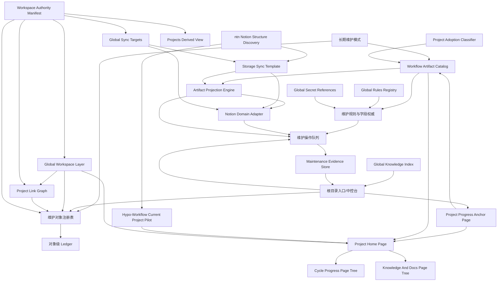

# Architecture Map

Deep Plan: 根目录项目管理模式

## Tracks

- T001: 根目录管理的真实闭环 (requirement, open)
  - depends_on: object Object
  - blocks: object Object
  - conflicts_with: object Object
  - feeds_into_plan: object Object
  - evidence_refs: references/config-spec.md:310, core/src/actions/index.js:62
- T002: 跨项目同步与状态聚合 (theme, open)
  - depends_on: object Object
  - blocks: object Object
  - conflicts_with: object Object
  - feeds_into_plan: object Object
  - evidence_refs: core/src/sync/index.js:18, core/src/sync/index.js:427
- T003: 用户界面与命令入口 (theme, secondary)
  - depends_on: object Object
  - blocks: object Object
  - conflicts_with: object Object
  - feeds_into_plan: object Object
  - evidence_refs: references/config-spec.md:316, core/src/tui/index.js:86
- T004: 长期维护态与数据对象模型 (requirement, active)
  - depends_on: object Object
  - blocks: object Object
  - conflicts_with: object Object
  - feeds_into_plan: object Object
  - evidence_refs: user-motivation-2026-05-18T15:36:58+08:00
- T005: Notion 同步作为首个维护域 (theme, active)
  - depends_on: object Object
  - blocks: object Object
  - conflicts_with: object Object
  - feeds_into_plan: object Object
  - evidence_refs: user-motivation-2026-05-18T15:36:58+08:00
- T006: Workflow Artifact Catalog 与 Notion 投影 (requirement, active)
  - depends_on: object Object
  - blocks: object Object
  - conflicts_with: object Object
  - feeds_into_plan: object Object
  - evidence_refs: user-artifact-scope-2026-05-18T15:50:01+08:00
- T007: Storage Sync Template 与多后端适配 (requirement, active)
  - depends_on: object Object
  - blocks: object Object
  - conflicts_with: object Object
  - feeds_into_plan: object Object
  - evidence_refs: user-storage-template-2026-05-18T15:59:28+08:00
- T008: 进度锚定页面与项目接入状态 (requirement, active)
  - depends_on: object Object
  - blocks: object Object
  - conflicts_with: object Object
  - feeds_into_plan: object Object
  - evidence_refs: user-progress-anchor-2026-05-18T15:59:28+08:00
- T009: Global Workspace 与跨项目联动层 (requirement, active)
  - depends_on: object-registry, policy-engine, storage-template
  - blocks: ordered_feature_queue:F001, ordered_feature_queue:F002
  - conflicts_with: root-entry-as-only-source-of-truth
  - feeds_into_plan: ordered_feature_queue:F001, ordered_feature_queue:F004
  - evidence_refs: user-global-layer-2026-05-18T18:06:57+08:00, references/config-spec.md:310, references/knowledge-spec.md:96

## Components

- maintenance-mode: 长期维护模式
  - 独立于 Cycle/Patch 的长期对象维护 lifecycle，负责 scan、diff、plan、apply、verify、record。
  - Evidence refs: user-confirmation-2026-05-18T15:44:44+08:00
- object-registry: 维护对象注册表
  - 记录 Project、Article、SyncTarget 等维护对象的本地身份、远端引用和当前状态。
  - Evidence refs: user-confirmation-2026-05-18T15:44:44+08:00
- object-ledger: 对象级 Ledger
  - 保存对象维护历史、同步事件、冲突处理和验证证据。
  - Evidence refs: user-confirmation-2026-05-18T15:44:44+08:00
- policy-engine: 维护规则与字段权威
  - 定义哪些字段由本地 Workflow 权威、哪些字段由 Notion 权威，以及冲突策略。
  - Evidence refs: user-confirmation-2026-05-18T15:44:44+08:00
- operation-queue: 维护操作队列
  - 将日常维护表达为可审计操作：scan、diff、dry-run、apply、verify、record。
  - Evidence refs: user-confirmation-2026-05-18T15:44:44+08:00
- notion-adapter: Notion Domain Adapter
  - 首个维护域适配器，负责读取/写入 Notion 既有项目笔记并生成 diff。
  - Evidence refs: user-confirmation-2026-05-18T15:44:44+08:00
- root-entry: 根目录入口/中控台
  - 可选聚合入口，展示对象状态、同步队列、阻塞项和跨项目维护摘要。
  - Evidence refs: user-confirmation-2026-05-18T15:44:44+08:00
- artifact-catalog: Workflow Artifact Catalog
  - 登记进度、架构图、prompt、report、文档等 artifact 的类型、权威源、更新频率、大小和同步策略。
  - Evidence refs: user-artifact-scope-2026-05-18T15:50:01+08:00
- projection-engine: Artifact Projection Engine
  - 将不同 artifact 按规则投影到 Notion 字段、页面正文、子页面、索引或链接，并生成 diff。
  - Evidence refs: user-artifact-scope-2026-05-18T15:50:01+08:00
- storage-template: Storage Sync Template
  - 通用存储同步模板，描述 page tree、artifact slots、record schema、operation protocol 和 backend adapter contract。
  - Evidence refs: user-storage-template-2026-05-18T15:59:28+08:00
- progress-anchor: Project Progress Anchor Page
  - 每个项目的稳定锚定页面，承载当前进度、同步索引、artifact slots、阻塞项和后续链接。
  - Evidence refs: user-progress-anchor-2026-05-18T15:59:28+08:00
- project-adoption-classifier: Project Adoption Classifier
  - 区分 Workflow-managed、pre-Workflow 和 unmanaged 项目，并决定可用 artifact 与缺失项处理。
  - Evidence refs: user-progress-anchor-2026-05-18T15:59:28+08:00
- ntn-discovery: ntn Notion Structure Discovery
  - 后续只读读取用户 Notion 页面/数据库结构，生成 storage mapping draft，不直接写远端。
  - Evidence refs: ntn-help-2026-05-18T15:59:28+08:00
- project-home: Project Home Page
  - 每个项目的 README-like 主页，承载项目介绍、当前状态、进度图表、artifact/domain 子页面入口和同步状态。
  - Evidence refs: user-page-tree-2026-05-18T16:09:39+08:00
- cycle-page-tree: Cycle Progress Page Tree
  - Project Home 下的进度细节子树，一个 Cycle 一个子页面，首页只保留进度图表/摘要。
  - Evidence refs: user-page-tree-2026-05-18T16:09:39+08:00
- knowledge-doc-tree: Knowledge And Docs Page Tree
  - Project Home 下的 Knowledge/docs 子树，按本地文件夹结构继续嵌套并保留源路径映射。
  - Evidence refs: user-page-tree-2026-05-18T16:09:39+08:00
- current-project-pilot: Hypo-Workflow Current Project Pilot
  - Deep Research 首个试点对象：当前 Hypo-Workflow 项目，用于生成 Project Home dry-run 和页面树映射。
  - Evidence refs: user-current-project-pilot-2026-05-18T16:09:39+08:00
- global-workspace: Global Workspace Layer
  - 位于单项目 Project Home 之上的全局维护层，聚合项目注册、跨项目关系、全局规则、全局 Knowledge、Secret 引用、同步目标和维护队列。
  - Evidence refs: user-global-layer-2026-05-18T18:06:57+08:00
- project-link-graph: Project Link Graph
  - 记录项目之间的联动关系，例如依赖、相关、共享规则、共享 Secret 引用、共享 Knowledge 和共同同步目标。
  - Evidence refs: user-global-layer-2026-05-18T18:06:57+08:00
- global-rules-registry: Global Rules Registry
  - 维护全局规则/习惯、项目覆盖关系和最终生效规则摘要，并向各项目 Project Home 提供链接。
  - Evidence refs: references/config-spec.md:623
- global-secret-refs: Global Secret References
  - 管理全局本地 raw key store `~/.hypo-workflow/secrets.yaml`；第一版不加密但要求 `0600`，Agent 可在任务匹配 capability 时自动读取 raw value；向仓库/Notion/Knowledge 只投影 provider、环境变量名、用途、依赖项目、健康状态和 redaction policy，raw key 不进入可同步层。
  - Evidence refs: references/knowledge-spec.md:96, .pipeline/deep-plans/DP001-root-project-management-mode/global-secret-store-schema.md
- global-knowledge-index: Global Knowledge Index
  - 聚合各项目 Knowledge compact/index 和跨项目经验，不复制所有 raw records，提供跨项目检索入口。
  - Evidence refs: references/knowledge-spec.md:84
- global-sync-targets: Global Sync Targets
  - 记录 Notion 等 storage backend 的 workspace/page/database 映射、项目页面路径、同步状态和 access gate。
  - Evidence refs: user-storage-template-2026-05-18T15:59:28+08:00
- workspace-authority: Workspace Authority Manifest
  - 用户级 `~/.hypo-workflow/workspace.yaml`，作为 Global Workspace 的对象身份、项目纳入、远端绑定、关系图、sync target、secret refs 和 policy refs 权威来源。
  - Evidence refs: .pipeline/deep-plans/DP001-root-project-management-mode/global-workspace-source-of-truth.md
- projects-derived-view: Projects Derived View
  - 现有 `~/.hypo-workflow/projects.yaml`，继续服务 Global TUI 和 project switcher；只保留项目状态摘要，不承载 Global Workspace authority。
  - Evidence refs: references/config-spec.md:310, .pipeline/deep-plans/DP001-root-project-management-mode/global-workspace-source-of-truth.md
- maintenance-evidence-store: Maintenance Evidence Store
  - 用户级 `~/.hypo-workflow/maintenance/`，保存维护队列、ledger、cache、dry-run/apply/verify 证据；不塞进 workspace manifest。
  - Evidence refs: .pipeline/deep-plans/DP001-root-project-management-mode/global-workspace-source-of-truth.md

## Edges

- maintenance-mode --> object-registry (owns lifecycle for)
  - 长期维护模式需要知道要维护哪些对象。
- object-registry --> object-ledger (records events in)
  - 对象状态变化必须可追踪。
- policy-engine --> operation-queue (gates)
  - 外部写入和冲突处理必须先经过规则判断。
- notion-adapter --> operation-queue (produces diffs for)
  - Notion 同步先生成 diff/dry-run，再进入 apply。
- root-entry --> object-registry (reads)
  - 中控台只是入口，不应成为 source of truth。
- root-entry --> operation-queue (displays and dispatches)
  - 用户从根目录查看和确认待执行维护操作。
- maintenance-mode --> artifact-catalog (scans)
  - 维护模式必须发现和分类需要同步的 Workflow artifacts。
- artifact-catalog --> policy-engine (feeds policy)
  - 不同 artifact 需要不同 authority、冲突和投影策略。
- artifact-catalog --> projection-engine (provides artifacts to)
  - 投影引擎根据 artifact 类型选择 Notion 表达方式。
- projection-engine --> notion-adapter (hands off changes to)
  - Notion adapter 只负责具体远端读写，投影规则不应散落在 adapter 内。
- projection-engine --> operation-queue (produces artifact diffs for)
  - artifact 同步也必须 dry-run/diff 后再 apply。
- storage-template --> projection-engine (defines slots for)
  - 投影引擎根据通用 slots 生成后端特定写入计划。
- storage-template --> notion-adapter (is implemented by)
  - Notion adapter 是 storage template 的首个后端实现。
- ntn-discovery --> storage-template (discovers mapping for)
  - ntn 只读发现用户现有页面结构，并生成模板映射草案。
- project-adoption-classifier --> artifact-catalog (filters available artifacts for)
  - 未接入 Workflow 的项目缺少 prompt/report/progress 等 artifact。
- progress-anchor --> artifact-catalog (anchors artifact index for)
  - 进度锚定页为所有后续 artifact 同步提供稳定挂载点。
- root-entry --> progress-anchor (summarizes)
  - 根目录入口聚合每个项目的锚定页状态。
- progress-anchor --> project-home (becomes)
  - 进度锚定页应升级为项目主页，而不只是进度页。
- project-home --> cycle-page-tree (contains)
  - Cycle 进度细节按子页面组织。
- project-home --> knowledge-doc-tree (contains)
  - Knowledge/docs 按域和文件夹结构挂载在项目主页下。
- artifact-catalog --> project-home (indexes into)
  - Project Home 提供 artifact/domain 入口。
- current-project-pilot --> project-home (validates template with)
  - 当前 Hypo-Workflow 项目用于第一轮模板验证。
- ntn-discovery --> current-project-pilot (discovers target for)
  - 后续 ntn 只读调研先限定到当前项目对应 Notion 页面。
- global-workspace --> object-registry (owns global view of)
  - 全局层需要知道有哪些项目、文章、同步目标和维护对象。
- global-workspace --> project-home (links to)
  - Workspace Home 是入口，Project Home 是单项目 canonical 内容页。
- global-workspace --> project-link-graph (contains)
  - 跨项目联动需要单独建模，不能只靠项目列表。
- project-link-graph --> object-registry (annotates relationships between)
  - 关系图需要引用稳定项目 id 和维护对象 id。
- global-rules-registry --> policy-engine (provides policy inputs to)
  - 全局规则和项目覆盖关系影响同步、写入、权限和输出边界。
- global-secret-refs --> policy-engine (constrains)
  - Secret 只能以引用和 redacted health 状态参与同步计划。
- global-knowledge-index --> root-entry (surfaces in)
  - 根目录入口需要展示跨项目可复用知识和关联项目。
- global-sync-targets --> storage-template (configures backend mappings for)
  - 通用 Storage Sync Template 需要知道各项目对应的后端路径与 access gate。
- global-sync-targets --> notion-adapter (provides target refs to)
  - Notion adapter 不应靠搜索猜测目标页，而应读取显式映射和权限状态。
- workspace-authority --> global-workspace (is source of truth for)
  - DR003 决定用户级 workspace manifest 承载全局对象身份、绑定、关系和 policy refs。
- workspace-authority --> object-registry (defines objects for)
  - 维护对象注册表从 workspace manifest 读取纳入项目、别名、remote refs 和 adoption status。
- workspace-authority --> project-link-graph (defines relations for)
  - Project Link Graph 引用 workspace 内稳定对象 id，避免关系散落在项目摘要文件中。
- workspace-authority --> global-sync-targets (defines backend targets for)
  - Notion 等后端路径和 access gate 是 Global Workspace 的长期配置。
- workspace-authority --> projects-derived-view (derives compatibility view into)
  - `projects.yaml` 继续供现有 Global TUI / project switcher 使用，但不作为 authority。
- operation-queue --> maintenance-evidence-store (records queue state in)
  - queue、ledger、cache 和 apply/verify evidence 是操作状态，应从 workspace manifest 中拆出。
- maintenance-evidence-store --> root-entry (surfaces current operations in)
  - 根目录入口显示队列和证据摘要，但不直接成为 source of truth。

## Open questions

- Notion 既有项目笔记 schema 如何映射到维护对象字段？
- 字段级 authority 是否需要从第一版开始支持？
- `workspace.yaml` 的第一版 schema 如何从 DR001/DR002 的项目对账和分类结果生成 draft？
- 非项目对象（文章、笔记、发布项）是否进入第一版验收？
- 不同 artifact 类型应该如何映射到 Notion：数据库字段、页面正文、子页面、附件，还是链接引用？
- Prompt 和 Report 是否应同步全文、摘要、索引，还是只同步 latest/current？
- 架构图应以 Mermaid 文本、渲染图片、还是 Notion block 结构同步？
- 文档同步需要双向编辑还是本地到 Notion 的单向发布？
- 每类 artifact 的 Notion 投影方式是什么：字段、正文、子页面、索引、链接或摘要？
- 哪些 artifact 需要双向同步，哪些必须本地单向权威？
- 第一版是否需要覆盖全部 artifact 类型的实际同步，还是先实现 catalog/diff 加部分 apply？
- Storage Sync Template 的最小抽象是 page tree、record schema、artifact slots、还是 operation protocol？
- 进度锚定页面应该包含哪些固定区块：当前状态、Cycle/maintenance queue、artifact index、last sync、blocked items、links？
- pre-Workflow 项目的进度如何表示：manual snapshot、legacy import、还是 pending-init？
- ntn 调研需要从哪个 Notion 根页面或数据库开始，只读范围如何限定？
- ntn 只读调研应从哪个 Notion 根页面/数据库开始？
- 进度锚定页面的固定区块是什么？
- Storage Sync Template 第一版是否需要支持 Notion 以外的真实后端，还是只保证 adapter contract？
- Workflow-managed / pre-Workflow / unmanaged 项目的分类规则和展示规则是什么？
- Deep Research 阶段是否只读 Notion，还是允许创建测试页面/沙盒页面？
- 第一版应更偏 schema discovery、local dry-run，还是 end-to-end 但只覆盖少量项目？
- 项目进度锚定页是否应成为所有 artifact 同步的强制入口？
- Project Home 上 README-like 项目介绍应从 README、PROJECT-SUMMARY、architecture 还是手写 metadata 生成？
- 进度图表第一版是 Mermaid/文本表格，还是 Notion database view？
- Cycle 子页面应从 archives/C*/summary.md 生成，还是从 state/log/report 聚合？
- Knowledge 子树是否直接镜像 .pipeline/knowledge/ 与 docs/，还是先只同步 compact/index？
- 当前 Hypo-Workflow 项目的 Notion 目标父页面/项目页在哪里？
- Project Home 的 README-like 内容源优先级是什么？
- Cycle 子页第一版是否从归档 summary 生成？
- Knowledge/docs 子树第一版是否只同步 compact/index 而非全文？
- 全局层哪些内容允许同步到 Notion，哪些只能留在本地：规则、Secret 引用、Knowledge、项目关系、队列？
- Project Link Graph 第一版的关系类型和 authority 应如何定义？
- 全局 Knowledge 是新建独立 ledger，还是从各项目 `.pipeline/knowledge/` compact/index 聚合生成？
- Global Secret Store 第一版应使用 `~/.hypo-workflow/secrets.yaml`、OS/keychain，还是二者抽象为可插拔 backend？

## Module cards

- MC-maintenance-store: Maintenance Store
  - responsibilities: 对象注册, 状态快照, 对象级事件日志, 阻塞/冲突记录
  - inputs: 项目 .pipeline 状态, Notion 页面/数据库记录, 用户维护规则
  - outputs: 对象状态表, 待同步 diff, 维护历史摘要
- MC-notion-sync-domain: Notion Sync Domain
  - responsibilities: 读取 Notion 现有项目笔记, 映射字段, 生成 dry-run diff, 提交外部写入后记录证据
  - inputs: Notion API/schema, 对象 registry, 字段 authority policy
  - outputs: sync plan, apply result, verification evidence
- MC-artifact-projection: Artifact Catalog And Projection
  - responsibilities: 分类 Workflow artifacts, 维护 source/derived/publication/evidence 类型, 选择 Notion 投影方式, 生成 artifact-level diff
  - inputs: .pipeline/PROGRESS.md, .pipeline/architecture.md, .pipeline/prompts/**, .pipeline/reports/**, docs/**, Notion mapping policy
  - outputs: artifact catalog, Notion projection plan, artifact sync diff
- MC-storage-template: Storage Sync Template
  - responsibilities: 定义通用页面树/slot/schema/operation 模板, 支持 Notion 以外的后端, 隔离 backend-specific 映射
  - inputs: artifact catalog, object registry, backend discovery result
  - outputs: storage mapping draft, backend operation plan
- MC-progress-anchor: Progress Anchor Page
  - responsibilities: 定义每项目固定锚定结构, 承载项目接入状态, 展示进度和 artifact index, 作为后续同步挂载点
  - inputs: project registry, .pipeline state/progress, adoption classifier
  - outputs: anchor page plan, anchor sync diff
- MC-project-home-template: Project Home Template
  - responsibilities: 生成 README-like 项目介绍, 展示当前状态和进度图表, 挂载 Cycle/Knowledge/Docs/Prompts/Reports 子页面入口, 记录 sync status
  - inputs: README.md, PROJECT-SUMMARY.md, .pipeline/state.yaml, .pipeline/archives/**/summary.md, .pipeline/knowledge/**, docs/**
  - outputs: Project Home dry-run plan, page tree mapping
- MC-current-project-pilot: Current Hypo-Workflow Pilot
  - responsibilities: 只针对当前项目生成 page tree dry-run, 验证 artifact slots, 发现缺失/过大/不适合同步的 artifact
  - inputs: current repository artifacts, optional Notion target page scope
  - outputs: pilot mapping report, first Project Home plan
- MC-workspace-authority: Workspace Authority Manifest
  - responsibilities: 定义 `~/.hypo-workflow/workspace.yaml` schema, 从 DR001/DR002 生成 workspace draft, 派生 `projects.yaml` 兼容视图, 检查 workspace / projects / Notion binding drift
  - inputs: DR001 global project reconciliation, DR002 project classification taxonomy, existing `~/.hypo-workflow/projects.yaml`, project `.pipeline` status snapshots
  - outputs: workspace draft, projects derived view, drift report
- MC-maintenance-evidence-store: Maintenance Evidence Store
  - responsibilities: 保存维护 queue, 保存 append-only ledger, 保存 dry-run/apply/verify evidence, 缓存跨项目扫描结果
  - inputs: maintenance operations, sync adapter results, verification evidence
  - outputs: queue snapshot, ledger events, evidence reports

## Evidence refs

- user-confirmation-2026-05-18T15:44:44+08:00
- user-artifact-scope-2026-05-18T15:50:01+08:00
- user-storage-template-2026-05-18T15:59:28+08:00
- ntn-help-2026-05-18T15:59:28+08:00
- user-page-tree-2026-05-18T16:09:39+08:00
- user-current-project-pilot-2026-05-18T16:09:39+08:00
